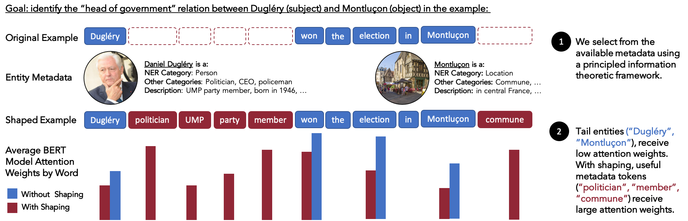

# Metadata Shaping: A Simple Approach for Knowledge-Enhanced Language Models

Metadata Shaping is a simple and effective approach to enhance LMs with knowledge. The method involves inserting readily available entity metadata into examples based on mutual information, and training on the shaped data. More details about our approach are described in our ACL paper [Metadata Shaping: A Simple Approach for Knowledge-Enhanced Language Models](https://arxiv.org/abs/2110.08430)

<p align="center"></p>


### Set Up
Use the following commands to clone and install this package. 

```
# environment
virtualenv -p python3 .venv
source .venv/bin/activate

git clone git@github.com:simran-arora/metadatashaping.git
cd metadatashaping
pip install -r requirements.txt
```


### Example use

Download prepared shaped data for the FewRel task here and place the data in the ```data/``` directory: https://drive.google.com/drive/folders/1tEuhAukhvwhW_7_tO-kG1plql2rSyp84?usp=sharing  

Run:
```
bash run_fewrel.sh
```


### Citation
```
@inproceedings{arora-etal-2022-metadata,
    title = "Metadata Shaping: A Simple Approach for Knowledge-Enhanced Language Models",
    author = "Arora, Simran  and Wu, Sen  and Liu, Enci  and Ré, Christopher",
    booktitle = "Findings of the Association for Computational Linguistics: ACL 2022",
    month = may,
    year = "2022",
    address = "Dublin, Ireland",
    publisher = "Association for Computational Linguistics",
    url = "https://aclanthology.org/2022.findings-acl.137",
    doi = "10.18653/v1/2022.findings-acl.137",
    pages = "1733--1745",
}
```

